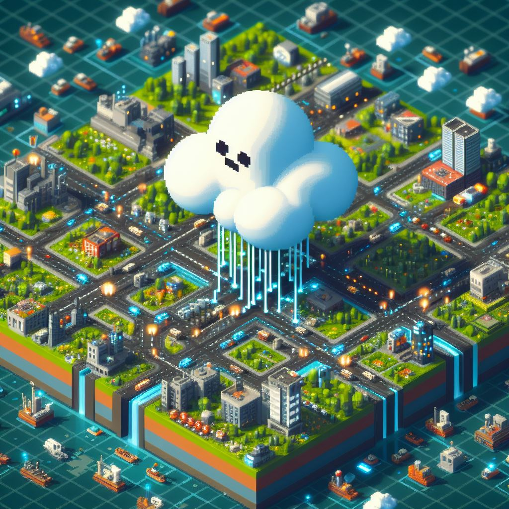

# Project-Bespin

"I don’t like it, I don’t agree with it, but I accept it." 
-Most Platform Engineers

A top-down 2D/2.5D/Isometric "Platform Engineering/Cloud Management Tool", designed to feel like a game and make Cloud Operations fun and arguably easier to manage.

## High Level Goals
- Make the experience of viewing/creating/managing cloud environments "fun and easy"
- Make the experience feel like playing a video game - should make it "fun"
- Any artifacts made by the game/tool should generate assets that can be used/created/modified by external tools and not dependent on this game/tool
    - Should read/create IaC code from establised tools like Terraform
    - Should be able to read and get information directly from the underlying "substrate" (i.e. Cloud Provider or Platform like Kuberentes)
    - Should integrate and use other tools and provide an escape hatch to onboard new ones
        - take on a "Hexagonal"/Adapter design pattern for integration with other tools

## Design Goals

This is starting out to be a personal project,  I want this to feel and be designed like a top-down "City Builder" game.  To me building out a "Cloud" or "Platform" is heavily analogous to building a city, to the extent that we have similar termninology and even whiteboard/design architecture in simialr ways.  We often describe "Infrastructure", "Services", "Identity" in similar ways and often try to draw analogies to real life city building/infrastructure as parallels.  Yes - there are incompatible instances where this analogy breaks...but overall I think this suits well to my personal mental model of how "Cloud" should be.

I currently work as a Principal Cloud Architect/Technical Specialist at Microsoft on the Azure Global Black Belt Team.  This is a side project for me to understand game development while also using it as a means to help with my day-to-day work helping customers design and implement their "Platform Engineering" solutions...which are varied and wildly different but ultimately have a similar underlying root problem....a myriad of tooling and how complex/painful and "un-fun" it is to use them all.  Dashboards are great to get information but it's not fun to use...nor does it provide the right visuals/interactions in my opinion.

## Starting Point

I believe the fundamental starting point for any Cloud/Platform is to build from the network layer up.  Networking is quite literally the core/fundamental backbone of any Cloud/Platform project, and right or wrong, is the starting point for any services to be deployed from, whether public (internet facing) and especially private (internal access only via VPN/AirGapped or other).

In addtion to this, the starting point to implement this should be evaluating the game engine frameworks and associated 1st class programming languages of each.  I want to avoid engine specific languages ("game-engine-x"-script) as the access to SDK/Libraries to access cloud provider resources would be severely limited in those languages.  Also whether this game should be a "native" desktop app or a web/html5 based is still being debated.

Short list:

| Framework | Language   | Platform |
|-----------|------------|----------|
| GODOT     | C#         | xplat    |
| Unity     | C#         | xplat    |
| pygame    | python     | Desktop  |
| phaser    | javascript | web      |

Based on the criteria I've set for myself, I believe the pragmatic approach is to use phaser as it provides a first class programing language with JavaScript, which allows us access to a breadth of SDKs, as well as the ability to create this app/game for the web, which provides us the most uniform platform to deploy/consume from.
